# DoomRL — Учење со поттикнување во ViZDoom

Осум агенти што учат да ја играат играта Doom само од сликата на екранот, по еден за секое
сценарио во [ViZDoom](https://vizdoom.farama.org/). Сите го користат истиот код; разликите меѓу
сценаријата се запишани како параметри на едно место.

Алгоритамот е PPO. Агентот нема пристап до координати, мапа или позиции на непријателите — ја
гледа само истата слика што би ја гледал и човек.

## Резултати

| Сценарио | Резултат | Максимум | Чекори |
|---|---|---|---|
| Health Gathering | **2100.00 ± 0.00** | 2100 | 600.000 |
| Take Cover | **2099.10 ± 1062.21** | нема | 1.500.000 |
| Deadly Corridor | **2065.45 ± 560.85** | околу 2100 | 1.350.000 |
| Defend the Line | **20.90 ± 3.26** | нема | 600.000 |
| Defend the Center | **19.43 ± 0.99** | 26 | 900.000 |
| Basic | **88.40 ± 9.56** | околу 95 | 200.000 |
| My Way Home | **0.99 ± 0.01** | 1.0 | 1.000.000 |
| Predict Position | **0.87 ± 0.28** | 1.0 | 4.000.000 |

Секој број е просек од 30 епизоди со детерминистички избор на акција. Вкупно се потрошени
10,15 милиони чекори за осумте модели, што на лаптоп со шест јадра и графичка картичка од 6 GB
трае околу 21 час.

## Инсталација

Потребен е Python 3.10–3.13.

```bash
py -3.13 -m venv .venv
.venv\Scripts\Activate.ps1
pip install -e .
```

За учење на графичка картичка, PyTorch треба да се инсталира во CUDA верзија од
[pytorch.org](https://pytorch.org/get-started/locally/), според драјверот на машината.

## Користење

```bash
doomrl train deadly_corridor
```

```bash
doomrl eval deadly_corridor
```

```bash
doomrl record deadly_corridor
```

```bash
doomrl play deadly_corridor
```

`train` запишува модели, логови за TensorBoard и `best_model.zip` во `runs/<сценарио>/`.
`eval`, `record` и `play` стандардно го земаат тој `best_model.zip`; со `--model` може да се
посочи друг.

`play` го отвора прозорецот на играта и го покажува агентот како игра во реално време, без да
запишува ништо. Служи за приказ во живо. Брзината се менува со `--speed` (`0.5` е половина брзина,
корисно кај `predict_position`), бројот епизоди со `--episodes`, а со `--seed` епизодите се
фиксираат ако треба да се повтори ист тек.

```bash
doomrl play defend_center --episodes 3 --speed 0.5
```

```bash
tensorboard --logdir runs
```

## Содржина

1. [Вовед](#1-вовед)
2. [Теоретски основи](#2-теоретски-основи)
3. [Средината ViZDoom](#3-средината-vizdoom)
4. [Имплементација](#4-имплементација)
5. [Резултати по сценарија](#5-резултати-по-сценарија)
6. [Заклучок](#6-заклучок)
7. [Литература](#7-литература)

---

## 1. Вовед

Целта на овој проект е програма што сама учи да игра Doom. Програмата не добива упатства како да
игра. Ја гледа сликата од екранот, притиска копчиња и добива бодови кога ќе направи нешто добро.
Со многу обиди сама открива што е исплатливо.

Обучени се осум агенти, по еден за секое сценарио во ViZDoom. Секое сценарио бара различна
вештина: во едно треба прецизно гаѓање, во друго избегнување проектили, во трето наоѓање излез од
лавиринт.

Користен е алгоритамот PPO, а влезот е само сликата од екранот — исто она што би го гледал играч.
Агентот нема пристап до координати, мапа или позиции на непријателите.

---

## 2. Теоретски основи

Овој дел објаснува како функционира учењето со поттикнување (reinforcement learning) и како работи
алгоритамот што е користен.

### 2.1 Основни поими

#### Агент и средина

Постојат две улоги. Агентот е програмата што носи одлуки. Средината е сѐ останато, во овој случај
играта Doom.

Меѓу нив постојано се разменува следното:

- Средината му дава состојба на агентот — тоа што агентот го гледа. Тука тоа е сликата од екранот.
- Агентот избира акција — кои копчиња ќе ги притисне.
- Средината враќа награда, изразена како број, и нова состојба.

Ова се повторува додека епизодата не заврши, на пример кога агентот ќе загине или кога ќе истече
времето. Потоа сѐ почнува одново.

#### Наградата

Наградата е единствениот сигнал што му кажува на агентот дали работи добро. Во сценариото
`defend_the_center` агентот добива +1 за секое убиено чудовиште и −1 кога ќе загине. Тоа е сѐ што
добива. Не му се објаснува дека треба да се сврти кон чудовиштето или дека прво треба да нишани.

Агентот не гледа само во следната награда. Целта му е збирот на сите идни награди. Затоа понекогаш
се исплати да се прифати мала загуба сега за да се добие повеќе подоцна. Во `deadly_corridor`
агентот мора да ризикува да биде повреден за да напредува низ ходникот.

#### Што го отежнува учењето

Наградата обично доаѓа доцна. Ако агентот загине по сто чекори, не е јасно кој чекор бил грешката,
можеби педесеттиот, кога тргнал во погрешна насока. Ова е познато како проблем на доделување
заслуга (credit assignment).

Покрај тоа, агентот постојано мора да бира меѓу истражување (exploration) и искористување
(exploitation). Ако секогаш го прави тоа што му изгледа најдобро во моментот, нема да проба ништо
ново и може да остане заглавен на слаба стратегија. Ако постојано пробува случајни работи, нема да
ја искористи вештината што ја стекнал.

Кај PPO ова е решено на едноставен начин. Агентот не избира една акција, туку дава веројатност за
секоја. На почетокот веројатностите се речиси еднакви, па агентот пробува сѐ. Како што учи,
тежината се префрла кон акциите што носат бодови.

### 2.2 Формална поставка

За проблемот да може да се реши со алгоритам, мора да се запише прецизно. Стандардниот запис се
вика Markov Decision Process (MDP) и содржи пет елементи.

| Ознака | Значење | Во овој проект |
|---|---|---|
| S | сите можни состојби | сите можни слики од екранот |
| A | сите можни акции | комбинации од копчиња |
| P | како средината преминува од состојба во состојба | правилата на Doom |
| R | функција на награда | дефинирана од сценариото |
| γ | фактор на намалување (discount factor) | 0.99 |

Името доаѓа од Markov property: следната состојба зависи само од сегашната состојба и од избраната
акција, а не од целата претходна историја. Ако тоа важи, агентот не мора да памети што се
случувало порано.

#### Фактор на намалување

Збирот на сите идни награди се вика return:

```
G  =  r₁ + γ·r₂ + γ²·r₃ + γ³·r₄ + …
```

*секоја следна награда се множи со сѐ помал број*

Бројот γ (discount factor) е меѓу 0 и 1. Кога е близок до нула, агентот гледа само во непосредната
награда. Кога е близок до еден, планира далеку напред.

Во овој проект γ = 0.99, што значи дека секој следен чекор вреди еден отсто помалку од
претходниот. Награда десет чекори однапред вреди околу 90 отсто од сегашната.

#### Колку вреди една состојба

Често се користат две функции. Првата, V(s), кажува колку бодови се очекуваат ако агентот се најде
во состојба s и продолжи да игра како што знае. Втората, Q(s,a), кажува исто, но за случај кога
прво ќе се изведе конкретна акција a.

Разликата меѓу нив се вика предност (advantage):

```
A(s,a)  =  Q(s,a) − V(s)
```

*колку оваа акција е подобра од просекот во таа состојба*

Ако предноста е позитивна, акцијата поминала подобро од очекуваното и треба да ѝ се зголеми
веројатноста. Ако е негативна, треба да се намали. Речиси целиот PPO се сведува на ова.

#### Белманова равенка

Вредноста на една состојба може да се пресмета преку вредноста на следната состојба. Не треба да
се пресметува сѐ до крајот на епизодата:

```
V(s)  =  r + γ·V(s′)
```

*вредноста сега е наградата сега плус намалената вредност на следната состојба*

Ова е основата на сите методи што учат вредности. Ако проценката за V(s) не се совпаѓа со тоа што
навистина се случило, разликата се користи за да се поправи проценката. Постапката се повторува
милиони пати.

### 2.3 Од Q-learning до PPO

#### Q-learning

Најпознатиот класичен алгоритам е Q-learning. Тој чува обична табела: по еден ред за секоја
состојба и по една колона за секоја акција. Во секое поле стои проценка колку бодови носи таа
акција во таа состојба.

На почетокот сите полиња се нули. По секој потег се поправа само едно поле:

```
Q(s,a)  ←  Q(s,a) + α · [ r + γ·max Q(s′,·) − Q(s,a) ]
```

Изразот во заграда е разликата меѓу тоа што агентот очекувал и тоа што навистина добил. Ако
очекувал три бода, а добил пет, разликата е позитивна и проценката се зголемува. Бројот α кажува
колку брзо се менува проценката.

За мали проблеми ова работи одлично. Кај лавиринт со дваесет полиња и четири акции, табелата има
осумдесет полиња и брзо се пополнува.

#### Зошто табела не може да се користи тука

Сликата во овој проект е 100×160 пиксели во сиви нијанси. Секој пиксел има 256 можни вредности, па
бројот на различни слики е:

```
256¹⁶⁰⁰⁰
```

Тоа е број со околу 38.500 цифри. Освен што таква табела не може да се направи, таа и не би
помогнала: агентот речиси никогаш нема да ја види истата слика двапати.

Потребно е нешто што генерализира: ако две слики си личат, проценката да биде слична. Токму тоа го
прават невронските мрежи. Затоа табелата се заменува со мрежа.

#### Три семејства на алгоритми

| Семејство | Што учи мрежата | Примери |
|---|---|---|
| Учи вредности | колку вреди секоја акција, се зема најдобрата | DQN |
| Учи политика | директно веројатност за секоја акција | REINFORCE, PPO |
| Актер-критичар | и политика и вредности заедно | PPO, A2C |

Во овој проект е користен PPO, кој спаѓа во третото семејство. Има два дела: актер, кој ја избира
акцијата, и критичар, кој проценува колку вреди состојбата. Двата дела ја делат истата мрежа за
обработка на сликата.

#### PPO

Основната идеја е едноставна: ако акцијата поминала добро, зголеми ѝ ја веројатноста; ако поминала
лошо, намали ја. Прашањето е колку да се смени.

Ако промената е премала, учењето трае предолго. Ако е преголема, политиката нагло се нарушува и
агентот заборава сѐ што научил. Тоа е особено опасно бидејќи агентот сам ги собира своите
податоци, нарушена политика значи и лоши податоци.

PPO го решава тоа со ограничување (clipping). Се пресметува односот меѓу новата и старата
веројатност за истата акција. Ако тој однос излезе надвор од интервалот од 1−ε до 1+ε, се сече на
границата:

```
L  =  min( r·A ,  clip(r, 1−ε, 1+ε)·A )
```

*r е односот нова наспроти стара веројатност, A е предноста, ε ≈ 0.1*

Со други зборови, ако акцијата била добра, веројатноста се зголемува, но најмногу за десет отсто
во едно ажурирање. Понатамошното зголемување не носи корист, па нема причина за голем скок.

#### Проценка на предноста

Предноста A не е позната однапред и мора да се процени. Ако се гледа само еден чекор напред,
проценката е стабилна но неточна. Ако се гледа до крајот на епизодата, точна е но со многу шум.
Методот GAE прави компромис меѓу двете преку параметар λ. Тука λ = 0.95, што е вообичаена
вредност.

#### Што се оптимизира

Мрежата истовремено учи три работи:

- **политика** — кои акции носат бодови
- **вредност** — колку вреди состојбата, за да може да се пресмета предноста
- **ентропија** — колку е неизвесна политиката. Овој член ја наградува неизвесноста и го спречува
  агентот прерано да се затвори во една стратегија.

Трите се собираат во една сума со тежини. Тежината на вредноста е 0.5, а на ентропијата 0.01.

### 2.4 Мрежа што работи со слики

#### Зошто конволуции

Сликата од 100×160 пиксели има 16.000 вредности. Ако тие се поврзат директно на слој од 512
неврони, се добиваат над осум милиони параметри само за првиот слој. Освен што е бавно, мрежата
нема ни да знае дека соседните пиксели се поврзани, за неа влезот е само долга низа на броеви без
распоред.

Конволуциската мрежа го решава ова на два начина. Прво, секој филтер гледа само мало парче од
сликата, на пример 8×8 пиксели. Второ, истиот филтер поминува низ целата слика, па ако научи да
препознава раб или контура, ја препознава каде и да се појави. Со тоа бројот на параметри се
намалува многукратно.

#### Архитектура

Користена е архитектурата од трудот на DeepMind за игрите од Atari. Таа и денес е стандардна
основа кога влезот се пиксели.

| Слој | Опис | Излез |
|---|---|---|
| Конволуција 1 | 32 филтри 8×8, чекор 4 | 32 мапи |
| Конволуција 2 | 64 филтри 4×4, чекор 2 | 64 мапи |
| Конволуција 3 | 64 филтри 3×3, чекор 1 | 64 мапи |
| Израмнување | мапите се трансформираат во еден вектор | вектор |
| Целосно поврзан | 512 неврони | 512 вредности |

Тие 512 вредности одат во два мали излезни слоја. Едниот дава веројатности за акциите, другиот
дава една бројка (проценка колку вреди состојбата). Двата слоја ја делат истата конволуциска
мрежа, што е побрзо и полесно за учење.

#### Редење рамки

Од една слика не може да се види движење. На статична слика не се знае дали чудовиштето оди лево
или десно, ниту колку брзо лета огнената топка.

Затоа во мрежата не влегува една слика, туку последните четири, наредени една врз друга. Влезот
има форма 4×100×160. Со четири последователни слики мрежата може да процени и правец и брзина.
Оваа техника се вика frame stacking.

Најважна е за две сценарија. Во `predict_position` агентот гаѓа подвижна цел со ракета што патува
одредено време, па мора да предвиди каде ќе биде целта. Во `take_cover` мора да процени во која
насока лета проектилот за да се тргне навреме.

---

## 3. Средината ViZDoom

### 3.1 Што е ViZDoom

ViZDoom дава програмски пристап до оригиналната игра Doom од 1993 година. Преку неа може да се
побара сликата од екранот, да се испратат копчиња и да се прочита наградата. Развиена е на
Универзитетот во Познањ, а денес ја одржува Farama Foundation.

Играта е погодна за оваа намена од неколку причини. Агентот гледа само слика од прво лице, исто
како човек. Играта е стара, па работи многу брзо и без графички приказ, што е потребно бидејќи
учењето бара милиони чекори. ViZDoom доаѓа и со готови сценарија со различна тежина.

### 3.2 Тикови и прескокнување рамки

Doom работи во внатрешни единици време што се викаат тикови. Во една секунда има 35 тикови.

Агентот не одлучува на секој тик. Тоа би било непотребно често и би го забавило учењето. Наместо
тоа, една акција се повторува неколку тикови. Тоа се вика frame skip. Вообичаената вредност тука е
4, што значи дека еден чекор на агентот трае околу 114 милисекунди.

### 3.3 Осумте сценарија

Секое сценарио бара различна вештина. Подетален опис, со снимка, график и резултати, има во
[делот 5](#5-резултати-по-сценарија).

| Сценарио | Што треба да направи агентот |
|---|---|
| `basic` | да застрела едно чудовиште пред себе |
| `defend_the_center` | да се брани од чудовишта што доаѓаат од сите страни |
| `defend_the_line` | да брани линија од чудовишта |
| `health_gathering` | да собира health додека подот му одзема живот |
| `take_cover` | да избегнува огнени топки |
| `predict_position` | да погоди подвижна цел со една ракета |
| `my_way_home` | да го најде излезот во мал лавиринт |
| `deadly_corridor` | да помине низ ходник со непријатели од двете страни |

---

## 4. Имплементација

### 4.1 Користени технологии

| Компонента | Верзија | За што служи |
|---|---|---|
| Python | 3.13 | програмски јазик |
| ViZDoom | 1.3.0 | средината |
| Gymnasium | 1.0 | стандарден интерфејс за RL средини |
| Stable-Baselines3 | 2.9 | готова имплементација на PPO |
| PyTorch | 2.13 (CUDA) | невронски мрежи |
| OpenCV | 5.0 | обработка на слики |

### 4.2 Структура на кодот

Целиот проект е еден пакет. Сите осум сценарија ја користат истата имплементација, а разликите
меѓу нив се запишани како параметри на едно место. Така секоја поправка се прави еднаш, наместо
осум пати.

| Модул | Што содржи |
|---|---|
| [`env.py`](doomrl/env.py) | средината: обработка на слики, акции, интерфејс кон Gymnasium |
| [`scenarios.py`](doomrl/scenarios.py) | параметрите за секое сценарио |
| [`vec.py`](doomrl/vec.py) | паралелно учење и wrapper-и над средината |
| [`train.py`](doomrl/train.py) | учење, хиперпараметри, чување модели |
| [`auxiliary.py`](doomrl/auxiliary.py) | помошната функција за препознавање непријател |
| [`evaluate.py`](doomrl/evaluate.py), [`record.py`](doomrl/record.py) | оценување и снимање видео |
| [`play.py`](doomrl/play.py) | приказ во живо во прозорецот на играта |
| [`cli.py`](doomrl/cli.py) | командите `train`, `eval`, `record` и `play` |

Параметрите за секое сценарио се запишани вака:

```python
@dataclass(frozen=True)
class Scenario:
    name: str
    config: str          # датотека од ViZDoom
    timesteps: int       # колку чекори трае учењето
    frame_skip: int = 4  # колку тикови трае еден чекор
    n_stack: int = 4     # колку слики се редат заедно
    exclusive_attack: bool = False
    aux_enemy: bool = False
```

*Дефиниција на сценарио ([doomrl/scenarios.py](doomrl/scenarios.py))*

### 4.3 Обработка на сликата

Сликата од играта е 320×240 во боја. Пред да влезе во мрежата се претвора во сиви нијанси и се
намалува на 100×160. Бојата ретко е пресудна за одлуката, а влезот се намалува околу дванаесет
пати.

```python
def _preprocess(self, screen):
    grey = cv2.cvtColor(np.moveaxis(screen, 0, -1), cv2.COLOR_BGR2GRAY)
    resized = cv2.resize(grey, (self.width, self.height),
                         interpolation=cv2.INTER_AREA)
    return resized.reshape(self.height, self.width, 1).astype(np.uint8)
```

*Обработка на една слика ([doomrl/env.py](doomrl/env.py))*

За намалување е користен `INTER_AREA`. Тој е соодветниот филтер кога сликата се намалува, за
разлика од `INTER_CUBIC`, кој е наменет за зголемување но внесува артефакти.

### 4.4 Средината

Средината го следи стандардот на Gymnasium. Најважна е функцијата што извршува еден чекор:

```python
def step(self, action):
    reward = self.game.make_action(self._to_buttons(action), self.frame_skip)
    self._tics += self.frame_skip
    done = self.game.is_episode_finished()
    truncated = done and self._timeout_tics > 0 \
        and self._tics >= self._timeout_tics
    terminated = done and not truncated
    return self._observe(), reward, terminated, truncated, self._info()
```

*Еден чекор во средината ([doomrl/env.py](doomrl/env.py))*

Тука е важна разликата меѓу `terminated` и `truncated`. Првото значи дека епизодата навистина
заврши: агентот загина или ја исполни целта. Второто значи дека само истекло времето, иако играта
можела да продолжи.

Разликата не е формална. Кога епизодата е прекината поради време, идните награди сѐ уште постоеле,
само престанале да се мерат. Ако тоа се смета за вистински крај, критичарот учи дека таа состојба
вреди нула, што не е точно.

ViZDoom не кажува кој од двата случаи се случил. Затоа средината сама ги брои тиковите и ги
споредува со ограничувањето на сценариото. Проверено е дека работи: во `basic` епизодата се
прекинува точно на 75 чекори, што е 300 тикови поделено со 4.

### 4.5 Кои копчиња може да се притискаат

Во Doom може да се притискаат повеќе копчиња истовремено: може да се оди напред и да се пука во
исто време. Најпростиот пристап е агентот да избира по едно копче, но тогаш не може да комбинира.

Затоа копчињата што се исклучуваат меѓусебно се групираат. Напред и назад одат во иста група, лево
и десно во друга, вртењето во трета. Секоја група има и опција „ништо“. Секое преостанато копче
стои само за себе, со две можности: притиснато или не.

| Сценарио | Копчиња | Комбинации |
|---|---|---|
| `basic` | странично движење, пукање | 6 |
| `take_cover` | странично движење | 3 |
| `my_way_home` | напред, странично, вртење | 18 |
| `deadly_corridor` | напред/назад, странично, вртење, пукање | 54 |

Кај `deadly_corridor` разликата е голема. Со 54 комбинации агентот може да напредува низ ходникот
додека се движи странично и пука истовремено, што е токму она што го бара тоа сценарио.

### 4.6 Паралелно учење

Учењето со една инстанца на играта е бавно. Освен тоа, сите примероци во едно ажурирање доаѓаат од
иста епизода и се слични меѓу себе, што му штети на учењето.

Затоа се пуштаат осум процеси со Doom истовремено. Врз нив се додаваат неколку обвивки
(wrappers): редење рамки, нормализација на наградите и преуредување на димензиите за PyTorch.

```python
venv = SubprocVecEnv(fns, start_method='spawn')  # 8 процеси
venv = VecMonitor(venv)                          # мери награди
venv = VecFrameStack(venv, n_stack=4)            # реди 4 слики
venv = VecNormalize(venv, norm_obs=False, norm_reward=True)
venv = VecTransposeImage(venv)                   # (100,160,4) -> (4,100,160)
```

*Составување на средината за учење ([doomrl/vec.py](doomrl/vec.py))*

Овде се појави проблем што не беше очигледен. OpenCV стандардно отвора онолку нишки колку што има
јадра процесорот, односно дванаесет на машината користена за учење. Со осум паралелни процеси тоа
значеше околу 96 нишки на 12 јадра. Резултатот не беше само забавеност, туку целосна
нестабилност:

| Број процеси | Пред поправка (чекори/сек) | По поправка (чекори/сек) |
|---|---|---|
| 1 | 471 | 432 |
| 2 | 65 | 738 |
| 4 | 203 | 809 |
| 6 | 68 | 830 |
| 8 | 293 | **917** |
| 12 | 777 | 740 |

Од табелата произлегува дека решението е ограничување на OpenCV на една нишка по процес. Без тоа
мерењето нема смисла, па не може ни да се избере оптимален број процеси. Од табелата се гледа дека
осум процеси даваат најдобра брзина, а дванаесет веќе е премногу бидејќи и самото учење бара
јадра.

### 4.7 Нормализација на наградите

Наградите во ViZDoom се на многу различни нивоа. Во `predict_position` се движат околу 1, а во
`basic` достигнуваат 100.

Бидејќи актерот и критичарот делат иста мрежа, големите награди прават големи грешки кај
критичарот, а тие грешки поминуваат низ заедничките слоеви. Затоа наградите се скалираат според
тековната стандардна девијација пред да влезат во оптимизацијата. Во логовите од учењето сепак се
запишуваат вистинските бодови, за да може резултатите да се читаат нормално.

### 4.8 Помошна функција

Во сценариото `defend_the_center` единствениот сигнал што ѝ кажува на мрежата како изгледа
непријател е +1 за убиство. За конволуциски слоеви тоа е редок сигнал.

Затоа е додаден втор излез од истата мрежа што предвидува дали има непријател точно под нишанот.
Точниот одговор го дава самата игра, преку слој со ознаки за секој пиксел. Мрежата учи и од
наградата и од овој дополнителен сигнал, па конволуциските слоеви побрзо учат да го препознаваат
непријателот.

Ознаката се користи само при учење, како точен одговор. Не влегува во мрежата како влез. Проверено
е експериментално: ако ознаката се смени, а сликата остане иста, излезот на политиката останува
идентичен.

### 4.9 Хиперпараметри

```python
PPO_KWARGS = dict(
    learning_rate=linear_schedule(2.5e-4),  # опаѓа кон 0
    n_steps=128,          # чекори по процес пред ажурирање
    batch_size=256,
    n_epochs=4,           # колку пати се користи истиот пакет податоци
    gamma=0.99,           # discount factor
    gae_lambda=0.95,
    clip_range=linear_schedule(0.1),
    ent_coef=0.01,        # тежина на ентропијата
    vf_coef=0.5,          # тежина на критичарот
    max_grad_norm=0.5,
)
```

*Параметри на PPO ([doomrl/train.py](doomrl/train.py))*

Вредностите се блиску до вообичаените за учење од пиксели. Две отстапувања вредат да се споменат.

Параметарот `n_epochs` е 4, а не 10. Тој кажува колку пати мрежата се ажурира врз истиот собран
пакет податоци пред да се соберат нови. Со поголема вредност мрежата премногу се прилагодува на
тие исти податоци и учењето станува нестабилно.

Тежината на ентропијата (`ent_coef`) е 0.01, а не 0 колку што е стандардно во библиотеката. Со
нула, агентот може прерано да се затвори во една стратегија и потоа воопшто да не проба ништо
друго.

---

## 5. Резултати по сценарија

### 5.1 Како се мерени резултатите

Секој агент е оценет одделно, на средина што не е користена за учење. При оценувањето агентот
секогаш ја избира најверојатната акција, без случајност, за да може резултатот да се повтори.

Секој број е просек од 30 епизоди. Кај `predict_position` се земени 100 епизоди, бидејќи наградата
таму е или 0 или 1, па со малку епизоди резултатот многу се разликува од тест до тест.

Резултатите не се земени од логовите за време на учењето. Причината е што моделот се зачувува кога
ќе постигне највисок резултат на некоја проверка, а во тој избор влегува и случајноста, не само
вештината. Затоа секој зачуван модел е оценет одново.

Графиконите подолу се направени од логовите на TensorBoard. Светлата линија е вистинската или raw
вредност, темната е нормализирана за подобро да се види трендот. Каде што при учењето се појави
проблем, тој е опишан веднаш кај сценариото на кое се однесува.

Снимките се направени со `doomrl record <сценарио>` од оценетите модели и се пуштени со околу 9
слики во секунда, што е реално време при frame skip 4 и 35 тикови во секунда.

### 5.2 Basic

Најпростото сценарио. Агентот стои во правоаголна соба, а на спротивниот ѕид се појавува едно
чудовиште на случајно место. Може само да се движи странично и да пука. Задачата е да го погоди
чудовиштето што побрзо.

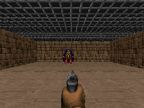

Наградата е +101 за погодок, −5 за промашен истрел и −1 за секој поминат тик. Значи брзината е
важна: колку подолго трае, толку помалку бодови остануваат. Епизодата трае најмногу 300 тикови.

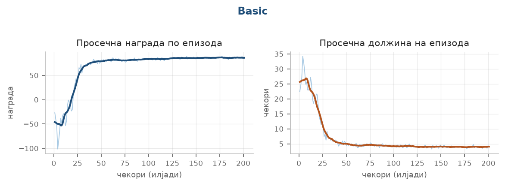

*Тек на учењето: лево просечна награда по епизода, десно просечна должина на епизода.*

На графиконот се гледа дека наградата брзо расте во првите 50 илјади чекори, а должината на
епизодата истовремено паѓа. Тоа е очекувано: агентот прво учи воопшто да погодува, а потоа учи да
го прави тоа побрзо.

#### Проблем: наградите ја заглушуваа политиката

Ова беше првото сценарио на кое се работеше и првите обиди пропаднаа. Агентот не само што не учеше
— со повеќе учење стануваше сѐ полош. По околу 60 илјади чекори наградата се смири на точно −300
бода и повеќе не мрдна.

Бројот −300 не е случаен. Тоа е најлошиот можен исход тука: 300 тикови по −1 бод, без ниту еден
испукан куршум. Значи агентот научил воопшто да не пука.

И тоа има своја логика. Секој промашен истрел кошта −5 бода, а на почетокот гаѓањето е слабо, па
повеќето истрели се промашени. Најбрзиот начин да се престане со губење бодови е воопшто да не се
пука. Но штом агентот ќе го научи тоа, тој повеќе никогаш не пука — па никогаш и не открива дека
погодокот носи +101.

#### Зошто се случи тоа

Причината е во тоа како е составена мрежата. Актерот и критичарот делат исти конволуциски слоеви.
Тие слоеви ја обработуваат сликата, а нивниот излез го користат и двата дела.

Критичарот учи да погоди колку бодови ќе донесе епизодата. Тука тие бодови се движат околу ±100.
Неговата грешка се мери како квадрат од разликата: ако промаши за 60 бода, грешката е 3.600.

Кога мрежата се ажурира, таа многу поголема грешка поминува низ заедничките конволуциски слоеви.
Слоевите се местат така што ќе му угодат на критичарот, а карактеристиките што ѝ требаат на
политиката се губат. Практично, критичарот ја загушува политиката.

#### Решение

Наградите се намалуваат пред да влезат во учењето. Пред секое ажурирање се делат со проценка на
нивното вообичаено отстапување, така што типична вредност станува околу 1 наместо околу 100.
Грешката на критичарот тогаш се движи околу 1 и повеќе не ги надвладува другите делови од мрежата.

Ова е само внатрешна пресметка при учењето. Во логовите и во резултатите се запишуваат вистинските
бодови од играта.

Разликата е проверена со два обиди што се разликуваат само по оваа поставка: ист број чекори, ист
seed за случајни броеви:

| Поставка | Просечна награда по 60.000 чекори |
|---|---|
| Сурови награди | −300.0 |
| Нормализирани награди | **+76.8** |

Оваа поправка потоа важеше за сите осум сценарија. Опишана е во [делот 4.7](#47-нормализација-на-наградите).

**Постигнат резултат: 88.40 ± 9.56.** Највисокиот можен резултат е околу 95, што би значело
погодок веднаш во првиот момент. Сценариото е решено.

### 5.3 Defend the Center

Агентот стои во центарот на кружна соба и не може да се движи, само да се врти и да пука.
Чудовиштата доаѓаат од сите страни и се приближуваат. Најважното ограничување е дека има точно 26
куршуми, без дополнување.

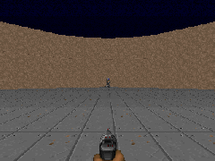

Наградата е +1 за секое убиено чудовиште и −1 кога агентот ќе загине. Бидејќи секое чудовиште
умира од еден погодок, а куршумите се 26, највисокиот можен резултат е 26. Со други зборови,
резултатот е прецизноста помножена со 26.

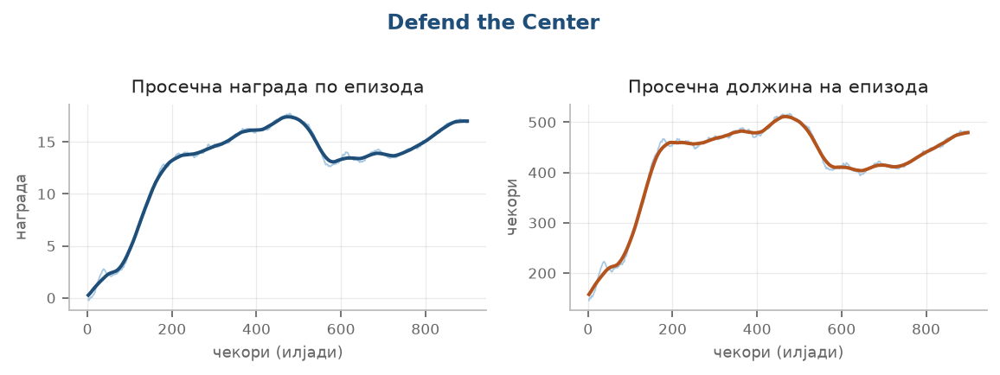

*Тек на учењето: лево просечна награда по епизода, десно просечна должина на епизода.*

Наградата расте до околу 17 во првите 500 илјади чекори. Должината на епизодата го следи истиот
облик, што е логично: колку повеќе чудовишта убива агентот, толку подолго преживува.

#### Проблем: агентот пукаше додека се врти

Ова сценарио долго стоеше на околу 9 бода. Повеќе учење не помагаше, односно кривата рано се
израмнуваше и таму остануваше.

Тука резултат од 9 значи следното: агентот има точно 26 куршуми и не добива нови. Секое чудовиште
умира од еден погодок, што значи дека бројот на убиства е точно бројот на погодоци. Оттука следува
дека највисокиот можен резултат е 26, а резултат од 9 значи дека од 26 истрели погодуваат само
девет.

Мерење на петнаесет епизоди го потврди тоа:

| Мерка | Вредност |
|---|---|
| Испукани куршуми | 26 од 26, во секоја епизода |
| Погодоци | 8.2 |
| Прецизност | 31.5 отсто |

Значи агентот не гине прерано и не троши куршуми на веќе мртви противници. Едноставно промашува
две третини од истрелите.

#### Зошто промашуваше

Одговорот се доби со броење кога точно се притиска копчето за пукање. Во 99.9 отсто од случаите
тоа се случува додека агентот истовремено се врти.

Тоа е доволно за да се промаши. Вртењето не е течно: една акција трае четири тикови и го поместува
нишанот за околу седум степени наеднаш. Ако истрелот падне среде таков скок, куршумот заминува
некаде помеѓу двете позиции, а не таму каде што нишанот бил насочен.

Причината е во тоа како беа поставени копчињата. Вртењето и пукањето беа две независни димензии,
па агентот можеше во ист чекор и да се врти и да пука. Освен тоа, немаше ништо што би го научило
да не го прави тоа: промашениот истрел не се казнува со ништо, само поминува незабележано.

#### Решение

Двете дејства се направени меѓусебно исклучиви. Сега агентот во еден чекор бира едно од четири:
врти лево, врти десно, пукај, или ништо. Ако избере да пука, во тој чекор не се врти, па нишанот
стои мирно додека куршумот се исфрла.

Дополнително е додадена и помошната функција од [делот 4.8](#48-помошна-функција), која ѝ помага
на мрежата побрзо да научи како изгледа непријател и каде се наоѓа на екранот.

| Поставка | Резултат | Прецизност |
|---|---|---|
| Вртење и пукање независни | 8.97 | 36.7 отсто |
| Меѓусебно исклучиви | 16.13 | 67.2 отсто |
| Плус помошна задача | **19.43** | **77.4 отсто** |

**Постигнат резултат: 19.43 ± 0.99**, односно прецизност од 77 отсто. Ова сценарио побара најмногу
работа од сите осум.

### 5.4 Defend the Line

Слично на претходното, но чудовиштата доаѓаат само од една страна, во линија. Агентот повторно
само се врти и пука, но тука има доволно муниција.

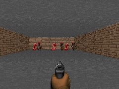

Наградата е +1 за убиство и −1 за смрт. Нема временско ограничување, па епизодата трае додека
агентот не загине. Затоа и нема природен максимум.

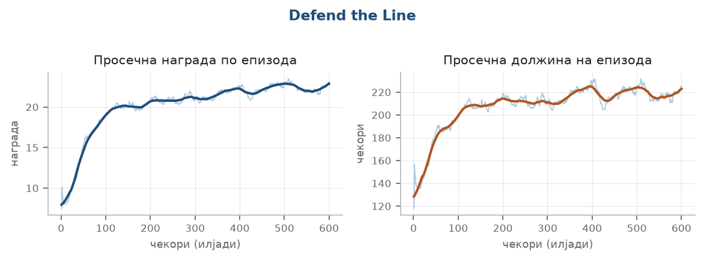

*Тек на учењето: лево просечна награда по епизода, десно просечна должина на епизода.*

Кривата расте постојано низ целото учење, без застој. Тоа значи дека со подолго учење агентот
веројатно би постигнал и повеќе.

**Постигнат резултат: 20.90 ± 3.26** убиства по епизода.

### 5.5 Health Gathering

Агентот е во соба со отровен под што постојано му одзема од животот. По подот се појавуваат health
packs. За да преживее, мора да се движи и да ги собира.

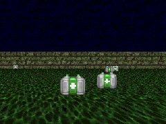

Наградата е +1 за секој тик поминат во живот. Епизодата трае најмногу 2100 тикови, што значи дека
највисокиот можен резултат е точно 2100 — агентот да преживее до крајот.

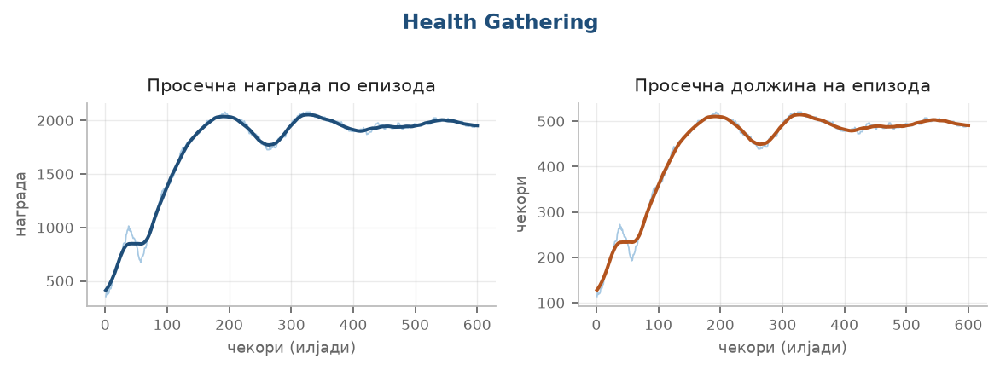

*Тек на учењето: лево просечна награда по епизода, десно просечна должина на епизода.*

Кривата брзо се качува до самиот максимум, но потоа не останува таму. Тоа е необично и е објаснето
подолу.

#### Проблем: подоцна во учењето агентот стана послаб

На графиконот се гледа нешто необично. Агентот го достигнува максимумот од 2100 бода на околу 100
илјади чекори, а потоа резултатот почнува да опаѓа и до крајот на учењето паѓа на 1164.

Причината е во тоа што над 2100 нема каде повеќе. Тоа е должината на епизодата, штом агентот научи
да преживее до истекот на времето, секоја епизода носи иста награда, без разлика како точно се
движел.

Од тој момент учењето нема од што да разликува подобро од полошо. Сите однесувања изгледаат
еднакво добри, па нема сигнал во која насока да се менува мрежата. Мрежата сепак продолжува да се
менува при секое ажурирање, само сега без насока.

Кон тоа се додава и членот за ентропија во функцијата на загуба. Тој намерно ја наградува
неизвесноста, за да не се затвори агентот прерано во една стратегија. Додека наградата дава јасен
сигнал, тој член е мал во споредба со неа. Кога наградата е рамна, тој останува единствениот
фактор што дејствува, па политиката полека се разлабавува и агентот почнува да прави повеќе
непотребни потези.

#### Решение

При учењето не се чува последниот модел, туку оној со најдобар резултат на периодичните проверки.
Тука разликата меѓу тие два модела е 2100 наспроти 1164 бода.

Истата појава, во помала мера, се повтори и кај `predict_position`, каде резултатот падна од 0.75
на 0.65 во последните 200 илјади чекори.

**Постигнат резултат: 2100.00 ± 0.00.** Отстапувањето е нула, што значи дека агентот преживеал до
крајот во сите 30 епизоди без исклучок. Сценариото е решено целосно.

### 5.6 Take Cover

Од спротивната страна на собата чудовишта фрлаат огнени топки кон агентот. Тој може само да се
движи лево и десно. Задачата е да преживее што подолго.

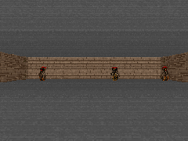

Наградата е +1 за секој тик во живот, без временско ограничување. Со текот на времето се појавуваат
сѐ повеќе противници, па епизодата секако еднаш завршува.

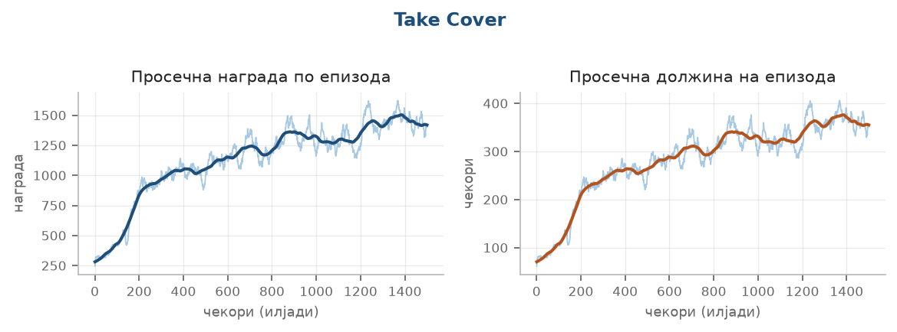

*Тек на учењето: лево просечна награда по епизода, десно просечна должина на епизода.*

Кривата расте низ целото учење. Големите осцилации на светлата линија не се грешка, туку особина
на сценариото: исходот многу зависи од тоа од каде ќе дојдат првите проектили.

**Постигнат резултат: 2099.10 ± 1062.21.** Просекот е висок, но отстапувањето е речиси исто толку
големо, понекогаш агентот преживува многу долго, понекогаш загинува рано.

### 5.7 Predict Position

Агентот има ракетен фрлач и точно една ракета. На спротивната страна се движи чудовиште
лево-десно. Ракетата патува одредено време, па нишанење право во целта не е доволно, туку треба и
да се погоди местото каде целта ќе биде кога ракетата ќе стигне таму.

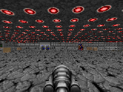

Наградата е +1 ако ракетата погоди и практично 0 ако промаши. Значи од цела епизода агентот добива
само една информација: успеал или не.

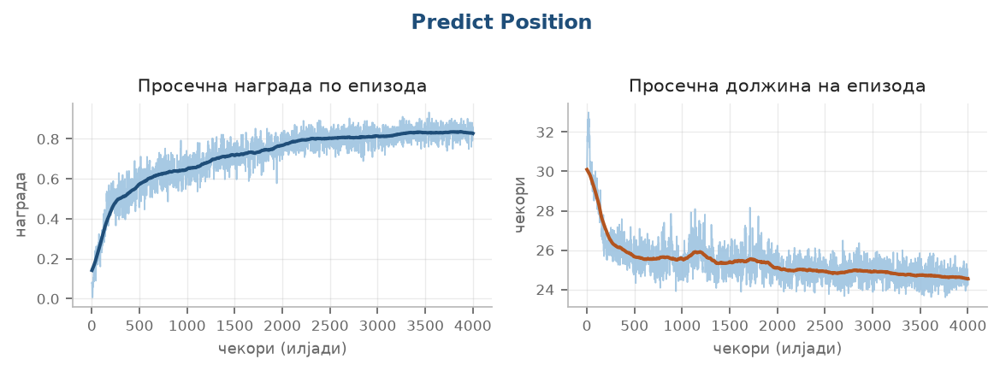

*Тек на учењето: лево просечна награда по епизода, десно просечна должина на епизода.*

Ова е сценариото со најдолго учење, четири милиони чекори. На графиконот се гледа зошто: кривата
расте бавно и рамномерно, без нагли скокови. Должината на епизодата паѓа затоа што со подобро
нишанење чудовиштето умира побрзо.

#### Проблем: мерењето беше преслабо за да го покаже напредокот

Ова сценарио најдолго остана нерешено. Резултатот стоеше на околу 0.58 и три различни измени не го
поместија. Изгледаше дека повеќе не може.

Се покажа дека проблемот не бил во учењето, туку во тоа што мерењето не можеше да го види
напредокот.

#### Зошто мерењето беше непрецизно

Наградата тука е или 1 или 0, односно погодок или промашување. Нема средни вредности. Проверката
на моделот за време на учењето се правеше на 10 епизоди, што е премалку и премногу случајно.

Подобрувањето што се бараше беше помало од тоа отстапување. Значи агентот можеби и напредуваше, но
тоа се губеше во шумот на мерењето.

#### Двете последици

Првата последица беше што напредокот изгледаше како да го нема. Кога бројот на епизоди при
проверка се зголеми од 10 на 30, отстапувањето падна речиси на половина и се виде дека агентот
навистина напредува, само бавно.

Втората последица беше потешка. Учењето има механизам што го прекинува кога долго нема
подобрување, а тој гледа само дали е поставен нов рекорд. При мерење на шум, една среќна проверка
постави рекорд од 0.778, што е повисоко од вистинската вредност во тој момент. Следните проверки
не можеа да го достигнат тој случајно висок праг, па механизмот заклучи дека нема напредок и го
прекина учењето на 1,5 од планираните 4 милиони чекори, иако кривата сѐ уште растеше.

#### Решение

Направени се три измени за ова сценарио: проверката се прави на 30 наместо на 10 епизоди,
автоматското прекинување е исклучено, и учењето се зголеми до полни четири милиони чекори.

Со тоа резултатот порасна од 0.58 на 0.87. Ниту една од трите измени не го смени самиот
алгоритам, променет е само начинот на кој се мери и колку долго се учи.

**Постигнат резултат: 0.87 ± 0.28**, односно погодок во 87 отсто од епизодите.

### 5.8 My Way Home

Агентот е поставен во мал лавиринт од неколку соби, на случајно место. Некаде во лавиринтот има
зелен елек. Задачата е да го најде.

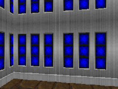

Наградата е +1 кога ќе стигне до елекот и мала казна од −0.0001 за секој тик. Значи највисокиот
резултат е близу 1, а колку побрзо го најде, толку помалку се одзема.

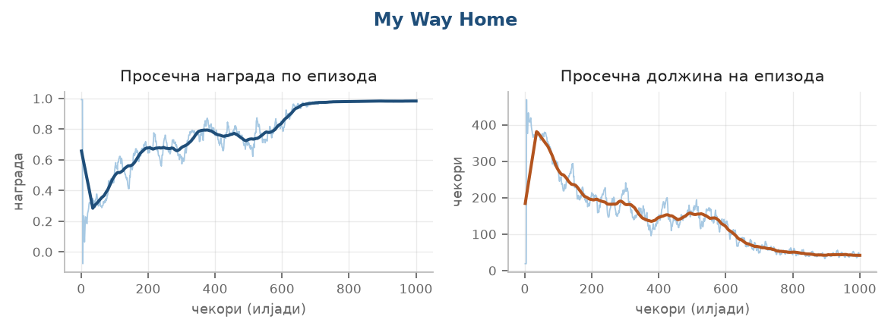

*Тек на учењето: лево просечна награда по епизода, десно просечна должина на епизода.*

Кривата расте нагло околу 200 илјади чекори и потоа останува рамна близу максимумот. Должината на
епизодата паѓа од максимално до многу кратко времетраење, што значи дека агентот престанал да лута
и почнал да оди директно.

**Постигнат резултат: 0.99 ± 0.01.** Агентот го наоѓа елекот речиси во секоја епизода.

### 5.9 Deadly Corridor

Најтешкото сценарио. Агентот треба да помине низ долг ходник до зелен елек на крајот. Од двете
страни има непријатели што пукаат. Тука агентот има најмногу можни движења: напред, назад,
странично, вртење и пукање.

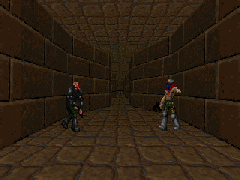

Наградата зависи од растојанието до елекот, колку понапред стигне, толку повеќе бодови. За смрт се
одземаат 100 бода. Сценариото е поставено на највисоко ниво тежина.

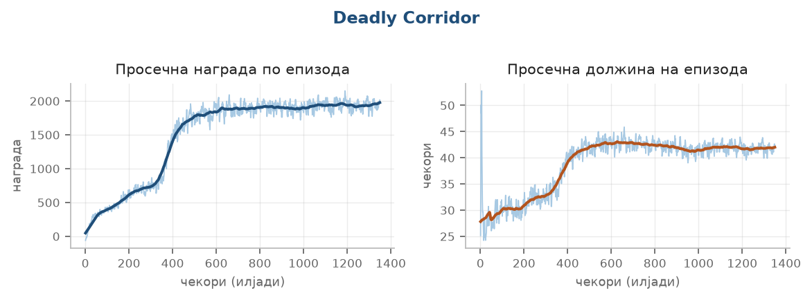

*Тек на учењето: лево просечна награда по епизода, десно просечна должина на епизода.*

Кривата расте брзо на почетокот, а потоа осцилира без јасен раст. Тоа е знак дека агентот ја
достигнал границата на она што може да се научи.

**Постигнат резултат: 2065.45 ± 560.85.** Големото отстапување покажува дека агентот понекогаш
стигнува до крајот, а понекогаш загинува на половина пат.

### 5.10 Збирна табела

| Сценарио | Резултат | Максимум | Чекори |
|---|---|---|---|
| Health Gathering | 2100.00 ± 0.00 | 2100 | 600.000 |
| Take Cover | 2099.10 ± 1062.21 | нема | 1.500.000 |
| Deadly Corridor | 2065.45 ± 560.85 | околу 2100 | 1.350.000 |
| Defend the Line | 20.90 ± 3.26 | нема | 600.000 |
| Defend the Center | 19.43 ± 0.99 | 26 | 900.000 |
| Basic | 88.40 ± 9.56 | околу 95 | 200.000 |
| My Way Home | 0.99 ± 0.01 | 1.0 | 1.000.000 |
| Predict Position | 0.87 ± 0.28 | 1.0 | 4.000.000 |

Вкупно се потрошени 10,15 милиони чекори за осумте модели. Учењето е правено на лаптоп со
процесор со шест јадра и дванаесет нишки, 32 GB работна меморија и графичка картичка со 6 GB. На
таква машина тоа трае околу 21 час. Со сите повторени и одбиени обиди, вкупното време е околу 35
часа.

---

## 6. Заклучок

Направени се осум агенти што играат Doom само врз основа на сликата од екранот. Health Gathering и
My Way Home се решени целосно, Basic и Predict Position се блиску до горната граница, а останатите
постигнуваат добри резултати.

Најважниот заклучок е дека алгоритамот не беше тесното грло. PPO е користен со речиси стандардни
параметри од почеток до крај и не е менуван. Сите поголеми подобрувања дојдоа од поставувањето на
проблемот: како изгледа влезот, што смее агентот да прави и на кое ниво се наградите.
Нормализацијата на наградите сама по себе беше разликата меѓу агент што не научи ништо и агент што
го решава сценариото.

Вториот заклучок е дека мерењето е подеднакво важно како и самото учење. Во два случаи проблемот
не беше во учењето, туку во тоа што мерењето не можеше да го покаже она што се случува. Кај
`defend_the_center` требаше да се изброи колку истрели промашуваат, наместо да се гледа само
наградата. Кај `predict_position` требаше да се зголеми бројот на епизоди при проверка.

### 6.1 Ограничувања

- Учењето и оценувањето се на иста мапа, па резултатот делумно мери и запаметување на мапата, а не
  само вештина.
- Секое сценарио е тренирано со еден seed за случајни броеви, па не се знае колку резултатот
  варира од обид до обид.
- Take Cover има големо отстапување меѓу епизодите, што значи дека однесувањето сѐ уште не е
  стабилно.

### 6.2 Можни подобрувања

- Мрежа со меморија (LSTM) наместо редење рамки.
- Еден агент што ги игра сите осум сценарија, наместо осум одвоени.

---

## 7. Литература

1. Sutton, R. S., Barto, A. G. (2018). *Reinforcement Learning: An Introduction*, 2. изд. MIT Press.
2. Schulman, J. и др. (2017). *Proximal Policy Optimization Algorithms*. arXiv:1707.06347.
3. Schulman, J. и др. (2016). *High-Dimensional Continuous Control Using Generalized Advantage Estimation*. arXiv:1506.02438.
4. Mnih, V. и др. (2015). *Human-level control through deep reinforcement learning*. Nature, 518, 529–533.
5. Watkins, C., Dayan, P. (1992). *Q-learning*. Machine Learning, 8, 279–292.
6. Kempka, M. и др. (2016). *ViZDoom: A Doom-based AI Research Platform for Visual Reinforcement Learning*. arXiv:1605.02097.
7. Lample, G., Chaplot, D. S. (2017). *Playing FPS Games with Deep Reinforcement Learning*. AAAI.
8. Raffin, A. и др. (2021). *Stable-Baselines3: Reliable Reinforcement Learning Implementations*. Journal of Machine Learning Research, 22(268).
